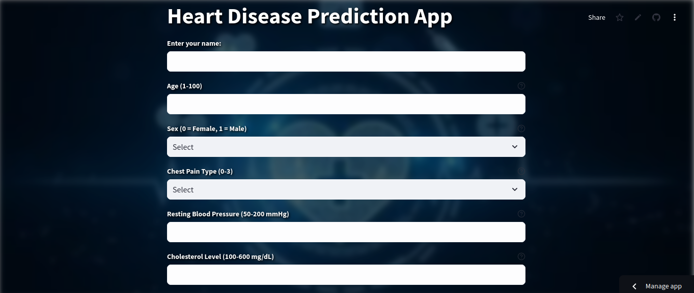
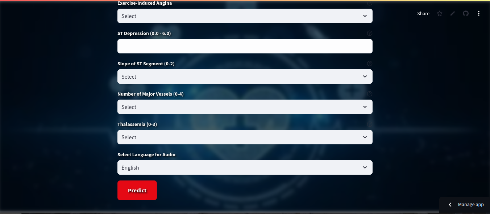

#  Heart Disease Prediction Web Application

The **Heart Disease Prediction Web Application** is a machine learning-powered web app designed to predict the risk of heart disease based on user input. It provides real-time input validation, downloadable reports, audio explanations, and personalized health suggestions to help users understand and improve their heart health.

## 📸 Screenshot
> 







## ✨ Features

✅ **User-friendly Interface:** Simple and clean form to input medical parameters.  
✅ **Real-time Input Validation:** Ensures user inputs are within valid medical ranges with instant feedback.  
✅ **Machine Learning Model:** Predicts heart disease risk using a trained Logistic Regression model.  
✅ **PDF Report Generation:** Generates a downloadable PDF of the prediction results.  
✅ **Audio Explanation:** Converts the prediction result into speech using text-to-speech (TTS).  
✅ **Medical Field Tooltips:** Hover tooltips explaining the significance of each input parameter.  
✅ **Personalized Suggestions:** Provides health tips based on the prediction to reduce risk and maintain heart health.  
✅ **Background Image:** Enhanced design with a clean background image.  
✅ **Deployed Online:** Access from anywhere through the Streamlit Community Cloud.  

## 🚀 Getting Started

Access the deployed app here:  
🔗 **[Heart Disease Prediction App](https://heart-disease-prediction-bgqhmfmjwmvjscatq3ph5j.streamlit.app/)**

## 🛠️ Installation (Local Setup)

```bash
git clone https://github.com/your-username/heart-disease-prediction.git
cd heart-disease-prediction
pip install -r requirements.txt
streamlit run app.py
```

## 💻 Usage

1. Open the app in your browser.
2. Enter your medical details (fields are validated in real-time).
3. Click **Predict** to see your heart disease risk result.
4. Download your **PDF Report** for future reference.
5. Listen to your **Audio Explanation**.
6. Get **Personalized Suggestions** based on your risk prediction.

## 🧠 Dataset Used

- **Source:** [Heart Disease Dataset - Kaggle](https://www.kaggle.com/datasets/johnsmith88/heart-disease-dataset)

## 🩺 Explanation of Input Fields & Importance

| Feature                 | Description                                                                                  | Importance                                                                      |
|------------------------ |----------------------------------------------------------------------------------------------|---------------------------------------------------------------------------------|
| **Age**                 | Age of the person                                                                            | Older age increases heart disease risk.                                        |
| **Sex**                 | 1 = Male, 0 = Female                                                                          | Males are at higher risk at younger ages.                                       |
| **Chest Pain Type (cp)**| Type of chest pain (0-3)                                                                      | Certain pain types indicate higher heart disease risk.                         |
| **Resting BP (trestbps)**| Resting blood pressure (mm Hg)                                                               | High BP is a major heart disease risk factor.                                   |
| **Cholesterol (chol)**  | Serum cholesterol level (mg/dl)                                                              | Higher cholesterol leads to artery blockage.                                   |
| **Fasting Blood Sugar (fbs)**| >120 mg/dl (1 = true, 0 = false)                                                        | High blood sugar is linked to heart problems.                                   |
| **Resting ECG (restecg)**| ECG results (0-2)                                                                            | Abnormal results may indicate heart issues.                                     |
| **Max Heart Rate (thalach)**| Max heart rate achieved                                                                  | Low max heart rate can be a risk indicator.                                     |
| **Exercise Induced Angina (exang)**| 1 = yes; 0 = no                                                                   | Pain during exercise is a red flag.                                             |
| **ST Depression (oldpeak)**| Depression induced by exercise relative to rest                                            | Measures heart stress during exercise.                                          |
| **Slope of ST Segment (slope)**| Slope of the peak exercise ST segment                                                  | Used to assess heart health during exercise.                                    |
| **Major Vessels (ca)**  | Number of major vessels (0-3) colored by fluoroscopy                                          | Higher number of blocked vessels = higher risk.                                 |
| **Thalassemia (thal)**  | 3 = normal, 6 = fixed defect, 7 = reversible defect                                           | Defects increase heart disease risk.                                            |


💬 **Suggestions are generated to help users understand the next steps to reduce or manage heart disease risk.**

## 🧠 Model Information

- **Algorithm:** Logistic Regression
- **Libraries:** numpy, pandas, scikit-learn, streamlit, gTTS, reportlab

## 📄 License

This project is licensed under the **MIT License**. See the [LICENSE](LICENSE) file for more details.


## 📞 Contact

For any queries:  
📧 **sowmyareddy.200047@example.com**  
💻 **GitHub:** [your-github-profile](https://github.com/sowmya5717)
